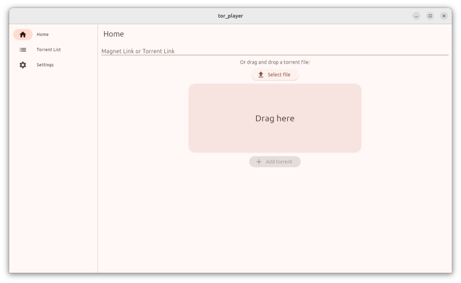
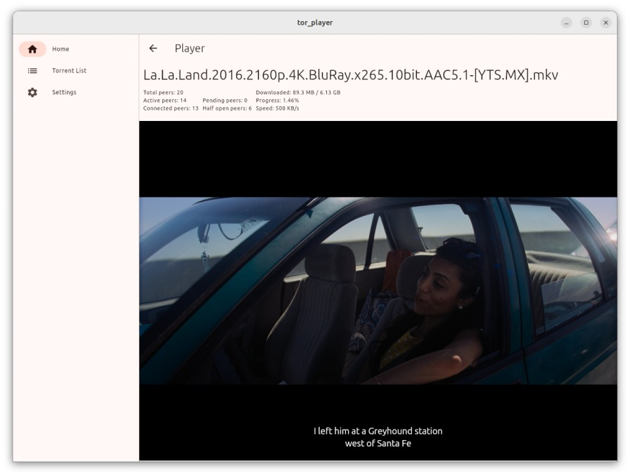

# Tor Player

A cross-platform application that allows users to stream videos from the torrent network.

## Features
- Stream videos directly from torrent files
- Cross-platform support
    - [x] Windows
    - [x] macOS
    - [x] Linux
    - [ ] Android
- User-friendly interface
- Support for various video formats
- Subtitle support
    - [ ] Adjust subtitle settings
- Download and watch offline

## Installation

### Prerequisites
- [Flutter](https://flutter.dev/docs/get-started/install) installed on your machine
- [Dart](https://dart.dev/get-dart) installed on your machine
- [Go](https://go.dev/) installed on your machine

### Steps
1. Clone the repository:
    ```sh
    git clone https://github.com/yourusername/TorPlayer.git
    cd TorPlayer
    ```

2. Install dependencies:
    ```sh
    flutter pub get
    ```

3. Run the application:
    ```sh
    flutter run
    ```

## Usage
1. Open the application
2. Paste the magnet link or upload a torrent file
3. Click on the play button to start streaming

**Note:** The torrent file will be downloaded to the default download directory on your machine. You can change the download directory in the settings.

### Screenshots



## Contributing
Contributions are welcome! Please open an issue or submit a pull request.
